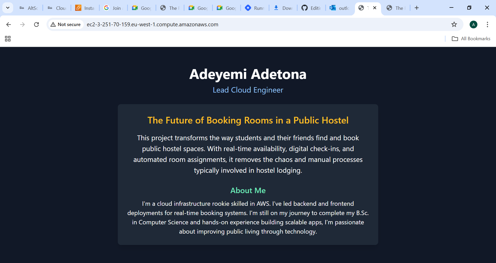

# Landing-page
“Cloud-deployed landing page showcasing a dynamic project using Nginx, Ubuntu, and Tailwind CSS”
# 🌐 Cloud-Deployed Landing Page – "The Future of Booking Public Hostels"

This project demonstrates the deployment of a responsive landing page on a live cloud server using Nginx and Tailwind CSS. It includes server provisioning, web server configuration, domain access, and HTTPS security.

---

## 📌 Project Overview

- **Name**: Adeyemi Adetona  
- **Role**: Cloud Solutions Architect  
- **Project**: The Future of Booking Public Hostels

> A smart, modern solution to hostel room booking. This landing page introduces a future-ready platform that enables students to easily book public hostel rooms through a transparent, mobile-friendly, and secure web interface.

---

## 🛠 Technologies Used

- Ubuntu 22.04 LTS (EC2)
- Nginx Web Server
- Tailwind CSS
- Let’s Encrypt (SSL)
- AWS EC2 Instance
- Git & GitHub

---

## ⚙️ Step-by-Step Setup

### ✅ 1. Provision the Server

- Launched an EC2 instance from the AWS Console:
  - OS: Ubuntu 22.04 LTS
  - Instance Type: t2.micro
  - Region: eu-west-1 (Ireland)
- Enabled Security Group rules:
  - Port 22 (SSH)
  - Port 80 (HTTP)
  - Port 443 (HTTPS)
- Connected via SSH:
  ```bash
  ec2-3-251-70-159.eu-west-1.compute.amazonaws.com

## 🖼️ Screenshot

Here’s a preview of the landing page rendered in a browser:



